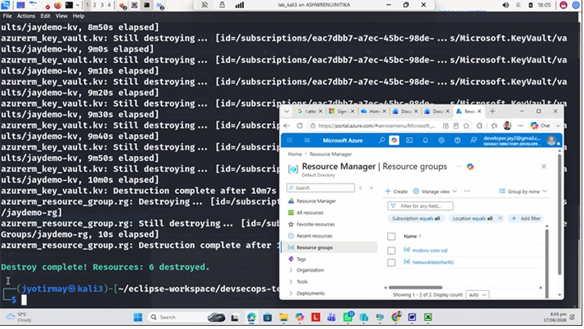
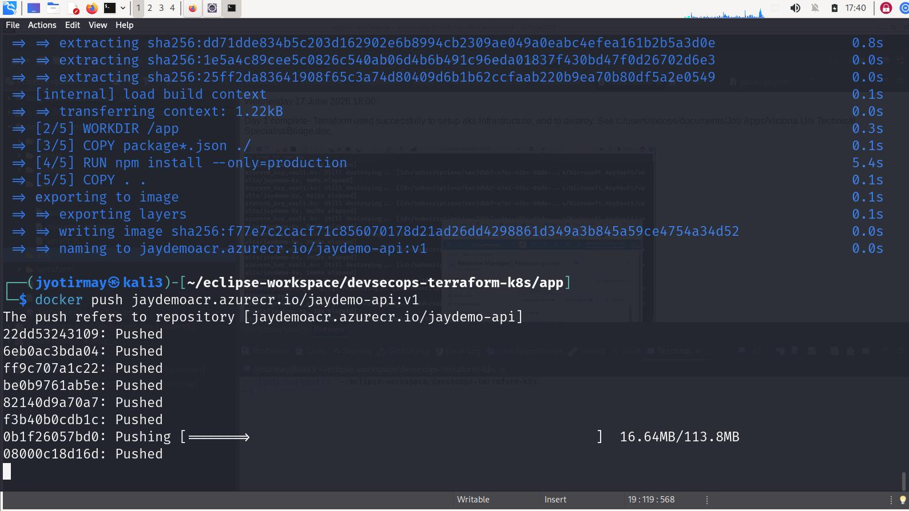
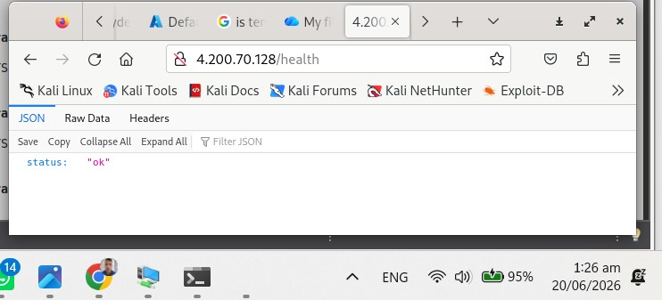
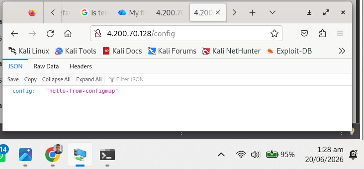
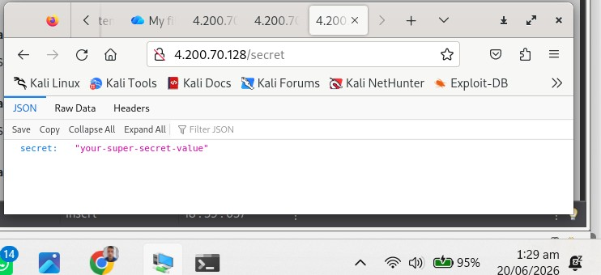
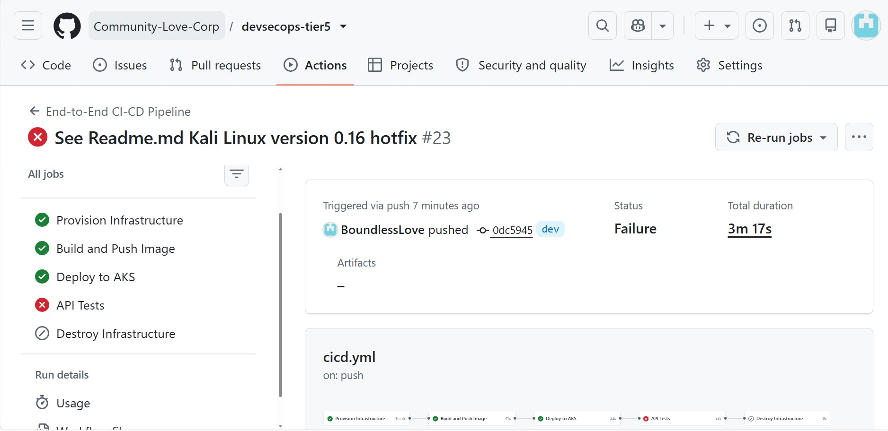

Versions

0.1 Kali Linux

Wednesday 17 June 2026 14:52: Eclipse setup. First draft for day 1.  

0.2 Kali Linux

Wednesday 17 June 2026 18:00: 

Day 1 complete- Terraform used successfully to setup aks infrastructure, and to destroy. See c:/users/moose/documents/Job Apps/Victoria Uni Technical Specialist/Bridge.doc. 

0.3 Kali Linux

Wednesday 17 June 2026 14:50: 

Added package.json and server.js. See See c:/users/moose/documents/Job Apps/Victoria Uni Technical Specialist/Part2Of4.doc. 

0.4 Kali Linux

Wednesday 17 June 2026 17:45: 

Successful image deployment - Step 3 completed. See See c:/users/moose/documents/Job Apps/Victoria Uni Technical Specialist/Part2Of4.doc. 

0.5 Kali Linux
Saturday 20 June 2026 01:55: 

For Details,  see c:/users/moose/documents/Job Apps/Victoria Uni Technical Specialist/Part2Of4.doc. 

0.6 Kali Linux
Saturday 20 June 2026 20:34: Preparation for pushing to public Git Repo: 
a. Remove cached provider binary/plugins from tracked files, and
b. Add it and similar files to .gitignore

0.7 Kali Linux
Saturday 20 June 2026 22:00: Repo sent to Github to dev branch- See Section 'Pre-req' in c:/users/moose/documents/Job Apps/Victoria Uni Technical Specialist/Part3Of4.doc. 

0.8 Kali Linux

Sunday 21 June 2026 14:00: 

Code added to enable CI/CD. See 'c:/users/moose/documents/Job Apps/Victoria Uni Technical Specialist/Part3Of4.doc'. 

0.9 Kali Linux

Sunday 21 June 2026 15:59: 

Simplified cicd code inorder to solve errors, added gates via environments in pipeline and gave some elevated permissions to terraform runner object in Azure. See Section 'Step 9 - Troubleshooting' in 'c:/users/moose/documents/Job Apps/Victoria Uni Technical Specialist/Part3Of4.doc'. 

0.10 Kali Linux

Sunday 21 June 2026 16:39: 

Idempotency issues existed because tfstate file is in .gitignore. Hence a cloud resource created to hold such information, in order to re-enable idempotency. In particular, backend added in terraform/providers.tf. For details, see Section 'Step 9 - Troubleshooting' in 'c:/users/moose/documents/Job Apps/Victoria Uni Technical Specialist/Part3Of4.doc'. 

0.11 Kali Linux

Sunday 21 June 2026 19:37: 

Added ability to recover soft-deleted secrets in key-vault to the terraform runner, due to Key Vault Access Policy current setup. For details, see Section 'Step 9 - Troubleshooting' in 'c:/users/moose/documents/Job Apps/Victoria Uni Technical Specialist/Part3Of4.doc'. 

0.12 Kali Linux

Sunday 21 June 2026 20:18: 

Updated providers.tf to ignore soft deleted resources, when creating resources, in order to prevent recovery as that interferes with idempotency. For details, see Section 'Step 9 - Troubleshooting' in 'c:/users/moose/documents/Job Apps/Victoria Uni Technical Specialist/Part3Of4.doc'. 

0.13 Kali Linux

Sunday 21 June 2026 20:52: 

Versin 0.12 failed as keyvault because even though terraform does not try to recover the keyvault, it still notices the name of the old key vault in the recycle bin and refuses to recreate it. Hence, the name of the keyvault has been updated this time. For details, see Section 'Step 9 - Troubleshooting' in 'c:/users/moose/documents/Job Apps/Victoria Uni Technical Specialist/Part3Of4.doc'. 

0.14 Kali Linux

Sunday 21 June 2026 21:21: 

The azure/login action had to added to all the downstream jobs in the cicd.yaml pipeline, so the terraform runner can authenticate with the cluster API. Similar other minor changes implemented. For details, see Section 'Step 9 - Troubleshooting' in 'c:/users/moose/documents/Job Apps/Victoria Uni Technical Specialist/Part3Of4.doc'. 

0.15 Kali Linux

Sunday 21 June 2026 21:37: 

Idempotency fix to infrastructure job in cicd.yml. It involved setting up .tfstate file in storage account during Terraform init. For details, see Section 'Step 9 - Troubleshooting' in 'c:/users/moose/documents/Job Apps/Victoria Uni Technical Specialist/Part3Of4.doc'. 

0.16 Kali Linux

Sunday 21 June 2026 23:46: 

Added RBAC to enable the cluster to access the key vault, to access secret. This is required because right now in cicd pipeline, the secret is unable to be retrieved using access policy setup. See keyvault.tf. For details, see Section 'Step 9 - Troubleshooting' in 'c:/users/moose/documents/Job Apps/Victoria Uni Technical Specialist/Part3Of4.doc'. 

0.17 Kali Linux

Sunday 22 June 2026 00:54: 

