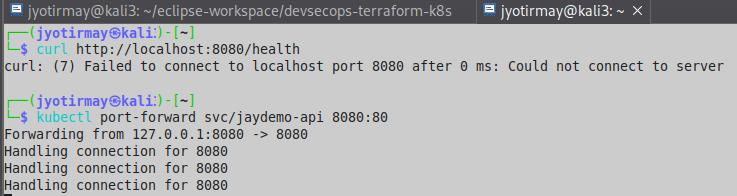
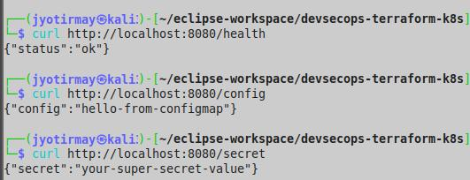
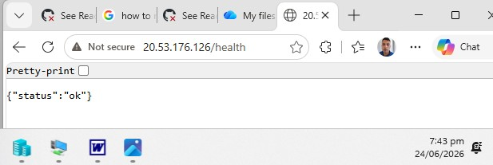
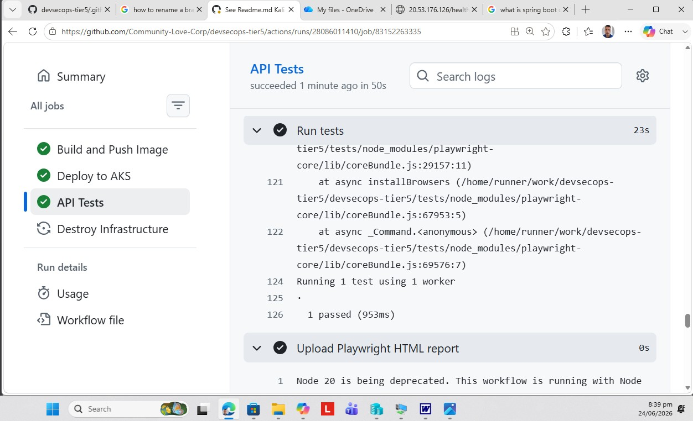

Versions

0.1 Kali Linux

Wednesday 17 June 2026 14:52: Eclipse setup. First draft for day 1.  

0.2 Kali Linux

Wednesday 17 June 2026 18:00: 

Day 1 complete- Terraform used successfully to setup aks infrastructure, and to destroy. See c:/users/moose/documents/Job Apps/Victoria Uni Technical Specialist/Bridge.doc. 


0.3 Kali Linux

Wednesday 17 June 2026 14:50: 

Added package.json and server.js. See See c:/users/moose/documents/Job Apps/Victoria Uni Technical Specialist/Part2Of4.doc. 

0.4 Kali Linux

Wednesday 17 June 2026 17:45: 

Successful image deployment - Step 3 completed. See See c:/users/moose/documents/Job Apps/Victoria Uni Technical Specialist/Part2Of4.doc. 


0.5 Kali Linux
Saturday 20 June 2026 01:55: 


For Details,  see c:/users/moose/documents/Job Apps/Victoria Uni Technical Specialist/Part2Of4.doc. 

0.6 Kali Linux
Saturday 20 June 2026 20:34: Preparation for pushing to public Git Repo: 
a. Remove cached provider binary/plugins from tracked files, and
b. Add it and similar files to .gitignore

0.7 Kali Linux
Saturday 20 June 2026 22:00: Repo sent to Github to dev branch- See Section 'Pre-req' in c:/users/moose/documents/Job Apps/Victoria Uni Technical Specialist/Part3Of4.doc. 

0.8 Kali Linux

Sunday 21 June 2026 14:00: 

Code added to enable CI/CD. See 'c:/users/moose/documents/Job Apps/Victoria Uni Technical Specialist/Part3Of4.doc'. 

0.9 Kali Linux

Sunday 21 June 2026 15:59: 

Simplified cicd code inorder to solve errors, added gates via environments in pipeline and gave some elevated permissions to terraform runner object in Azure. See Section 'Step 9 - Troubleshooting' in 'c:/users/moose/documents/Job Apps/Victoria Uni Technical Specialist/Part3Of4.doc'. 

0.10 Kali Linux

Sunday 21 June 2026 16:39: 

Idempotency issues existed because tfstate file is in .gitignore. Hence a cloud resource created to hold such information, in order to re-enable idempotency. In particular, backend added in terraform/providers.tf. For details, see Section 'Step 9 - Troubleshooting' in 'c:/users/moose/documents/Job Apps/Victoria Uni Technical Specialist/Part3Of4.doc'. 

0.11 Kali Linux

Sunday 21 June 2026 19:37: 

Added ability to recover soft-deleted secrets in key-vault to the terraform runner, due to Key Vault Access Policy current setup. For details, see Section 'Step 9 - Troubleshooting' in 'c:/users/moose/documents/Job Apps/Victoria Uni Technical Specialist/Part3Of4.doc'. 


0.12 Kali Linux

Sunday 21 June 2026 20:18: 

Updated providers.tf to ignore soft deleted resources, when creating resources, in order to prevent recovery as that interferes with idempotency. For details, see Section 'Step 9 - Troubleshooting' in 'c:/users/moose/documents/Job Apps/Victoria Uni Technical Specialist/Part3Of4.doc'. 

0.13 Kali Linux

Sunday 21 June 2026 20:52: 

Versin 0.12 failed as keyvault because even though terraform does not try to recover the keyvault, it still notices the name of the old key vault in the recycle bin and refuses to recreate it. Hence, the name of the keyvault has been updated this time. For details, see Section 'Step 9 - Troubleshooting' in 'c:/users/moose/documents/Job Apps/Victoria Uni Technical Specialist/Part3Of4.doc'. 

0.14 Kali Linux

Sunday 21 June 2026 21:21: 

The azure/login action had to added to all the downstream jobs in the cicd.yaml pipeline, so the terraform runner can authenticate with the cluster API. Similar other minor changes implemented. For details, see Section 'Step 9 - Troubleshooting' in 'c:/users/moose/documents/Job Apps/Victoria Uni Technical Specialist/Part3Of4.doc'. 

0.15 Kali Linux

Sunday 21 June 2026 21:37: 

Idempotency fix to infrastructure job in cicd.yml. It involved setting up .tfstate file in storage account during Terraform init. For details, see Section 'Step 9 - Troubleshooting' in 'c:/users/moose/documents/Job Apps/Victoria Uni Technical Specialist/Part3Of4.doc'. 


0.16 Kali Linux

Sunday 21 June 2026 23:46: 

Added RBAC to enable the cluster to access the key vault, to access secret. This is required because right now in cicd pipeline, the secret is unable to be retrieved using access policy setup. See keyvault.tf. For details, see Section 'Step 9 - Troubleshooting' in 'c:/users/moose/documents/Job Apps/Victoria Uni Technical Specialist/Part3Of4.doc'. 

0.17 Kali Linux

Sunday 22 June 2026 00:54: 


However app not functional because of error on cmd 'kubectl describe pod jaydemo-api-xxx..':

```
ManagedIdentityCredential authentication failed.
the requested identity isn't assigned to this resource.
Identity not found.
```

0.18 Kali Linux

Monday 22 June 2026 16:07: 

Updated keyvault.tf, to use kubelet identity to access keyvault:

```terraform
data "azurerm_client_config" "current" {}

resource "azurerm_key_vault" "kv" {
  name                       = "${var.prefix}-kv-v2"
  location                   = var.location
  resource_group_name        = azurerm_resource_group.rg.name
  tenant_id                  = data.azurerm_client_config.current.tenant_id
  sku_name                   = "standard"
  purge_protection_enabled   = false
  soft_delete_retention_days = 7

  # Access for YOU (so Terraform can create secrets)
  access_policy {
    tenant_id = data.azurerm_client_config.current.tenant_id
    object_id = data.azurerm_client_config.current.object_id

    secret_permissions = [
      "Get",
      "List",
      "Set",
      "Delete",
      "Purge",
      "Recover"
    ]
  }

  # Access for the AKS kubelet identity (REQUIRED FOR CSI DRIVER)
  access_policy {
    tenant_id = data.azurerm_client_config.current.tenant_id

    # This is the correct identity for CSI secret mounts
    object_id = azurerm_kubernetes_cluster.aks.kubelet_identity[0].object_id

    secret_permissions = [
      "Get",
      "List"
    ]
  }
}

resource "azurerm_key_vault_secret" "mysecret" {
  name         = "mysecret"
  value        = "your-super-secret-value"
  key_vault_id = azurerm_key_vault.kv.id
}

```
Hotfix #2: 

Monday 22 June 2026 16:25 

The CICD pipeline experienced a race condition trying to update both the key vault and aks cluster parallely after change above. Hence added following snippet after keyvault creation and before applying access policies:

```
  depends_on = [
    azurerm_kubernetes_cluster.aks
  ]
```

Hotfix #3: 

Monday 22 June 2026 17:00

Turns out that key vault needs CSI driver to be installed. Presently, MS does not expose that addon to the provider to enable via terraform, hence a null_resource has been added to aks.tf, in order to remain committed to IaC paradigm. Futher, Update/Creation of key vault is made dependant on running of that code snipped. 


Hotfix #5: 

Monday 22 June 2026 17:14

Added another null_resource to first disable the driver, and then reenable it because terraform was saying that the resource is already enabled.


0.19 Kali Linux local branch

Wednesday 24 June 2026 15:22: Baseline before localising the Continuous Integration and Continuous Development (CICD) non-working solution, in order to localise it (non CI-CD), in order to troubleshoot/test/debug it more easily before returning to another attempt to implement CICD. See Terraform state:

┌──(jyotirmay㉿kali3)-[~/eclipse-workspace/devsecops-terraform-k8s/terraform]
└─$ terraform state list
data.azurerm_client_config.current
azurerm_container_registry.acr
azurerm_key_vault.kv
azurerm_key_vault_access_policy.csi[0]
azurerm_key_vault_secret.mysecret
azurerm_kubernetes_cluster.aks
azurerm_resource_group.rg
azurerm_role_assignment.aks_acr_pull
azurerm_subnet.subnet
azurerm_user_assigned_identity.csi_identity
azurerm_virtual_network.vnet

1.0 Kali Linux local branch - working

Wednesday 24 June 2026 17:53:

SETUP PORT FORWARDING: 



TEST:



0.19 Kali Linux local branch

Wednesday 24 June 2026 15:22: 

1.1 Kali Linux 

Wednesday 24 June 2026 18:30:

Attempt #2 to make app work on AKS with CICD.

1.2 Kali Linux 

Wednesday 24 June 2026 19:30:

Attempt #2 succeeded, but playwright test failed as the test code was using request.get with a baseurl variable. However, a baseurl variable only works automatically, as the request.get was assuming, if the command using it is request.goto. Hence, updated this code snippet to use process variable to gather the url provided by pipeline. Since Typescript does not know about Node.js global variables like 'process',  so ran 'npm install --save-dev @types/node', and this make typescript recognise the process variable. This command was also added to cicd.yaml.


Hotfix # 1

Wednesday 24 June 2026 19:48:




Hotfix # 3:

Wednesday 24 June 2026 20:30:

The tests were not working as the incorrect variable for API_URL was being referenced. Replaced cicd test job's 'Run tests' step:

```
    - name: Run tests
      env:
        API_URL: ${{ secrets.API_URL }}
      run: npm run test:ci --reporter=line
      working-directory: tests
```

TO (note the change in 'env:' label) 

```
    - name: Run tests
      env:
        API_URL: ${{ env.API_URL }}
      run: npm run test:ci --reporter=line
      working-directory: tests
```



1.3 Kali Linux 

Thursday 25 June 2026 17:35: Fix made to make get reports working. In particular, the fix was made to tests/playwright.config.ts:

```
import { defineConfig } from '@playwright/test';

export default defineConfig ({
  use: {
   baseURL: process.env.API_URL, 
  },
  reporter: [
    ['html', { outputFolder: 'playwright-report', open: 'never' }],
    ['allure-playwright']
  ],
});
```